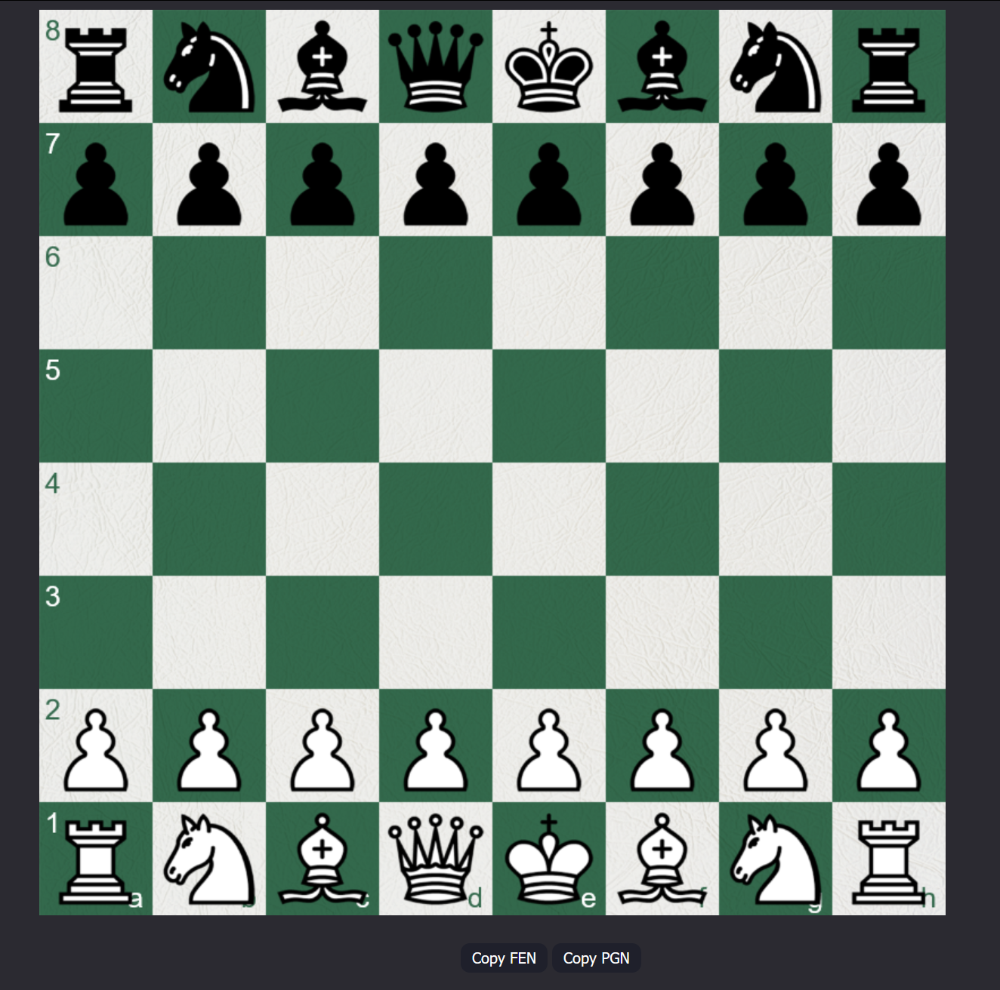
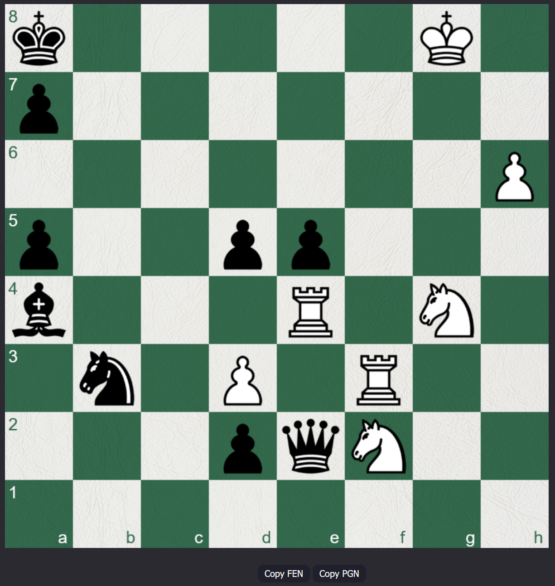

# What is this?
This repository includes a project I randomly felt like making, basically just a copy of chess.com chess. Nothing super special here. It's just chess. Allows you to play both sides, each piece moving how you would expect. Allowing you to win by checkmate. Allowing draws by stalemate, 50-move rule, threefold-repetition, and insufficient material. The page also copies the PGN string to your clipboard when the game ends, or alternatively, you can copy the FEN string or PGN string with the supplied buttons.

I used two seperate canvas's to render the main board and the pawn promotion to simplify things in my mind.

# Why?
Because I had nothing else to do during break.

# Lemme download it
Use `git clone https://github.com/Maxisthemoose/html-js-chess.git` or just download the zip file. Then you can just open the html file in whatever browser you want.

# Screenshots

